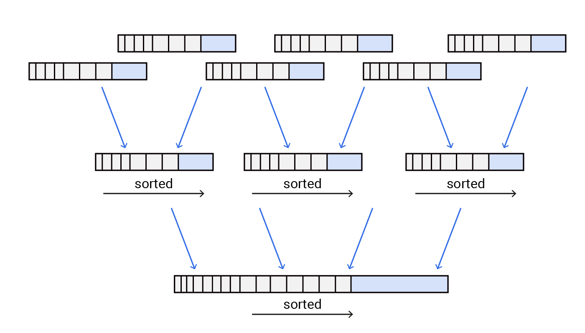

# Scala LSM Trees (Toy Project Do Not Use)



Toy implementation of LSM Trees in Scala using information from DDIA

## Motivations

I learned about LSM Trees & B-Trees while reading Chapter 3 of DDIA. While I have implemented a B-Tree in Python in a course at UMD, I never wrote an implementation of an LSM tree. As a result, I really had to try it. I was also interested in Scala for quite a while, so I thought of killing two birds with one stone here.

## Included Features

Features include:
- `GET` operation
- `PUT` operation
- `DELETE` operation using `TOMBSTONE` markers
- Asynchronous `MemTable` to `SSTable` flushing
- Write Ahead Logging of the `MemTable`
- Recovery of database on restart

## Missing Features

Missing features include:
- Compaction background process (will implement next when I get back to this in the near future)
- Bloom filter in `SSTable`
- Rehaul of identification for `SSTable`, `MemTable`, and `WAL`
- Additional metadata and checksums for `SSTable`
- More ideas that I come up with in the future

## Usage

```scala
@main def main(): Unit = {
  val tree = new LSMTree()
  tree.open("testdb")
  for (i <- 1 to 200) {
    tree.put(s"Key$i", s"Value$i")
  }
  Thread.sleep(2000)
  for (i <- 1 to 200) {
    val res = tree.get(s"Key$i")
    assert(res.isDefined && res.get == s"Value$i")
  }
  tree.close()
}
```
